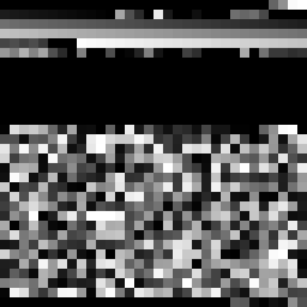

# printb

Cute little command for visualizing binary blobs. Which can lend insight into
structure at a glance.

Dual-licensed under MIT or the [UNLICENSE](https://unlicense.org).

```sh
printb song.mp3 -n 1000 -w 32 -o examples/image.png
```

<p align="center">
  
</p>
